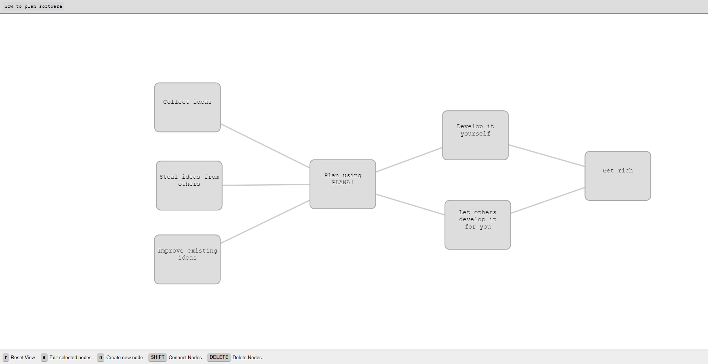

<!---->

PLANA! is an open source diagram creation software that allows you to plan structures using nodes and connections between them.

# Features
- Create nodes
- Connect nodes
- Move nodes, pan and zoom canvas
- Safe and load projects
- Double click on nodes to create sub-pages ("spaces!")

# ToDo
- Node Styles (Presets maybe?)
- Different connection types (Simple, Arrow, Bidirectional, etc.)
